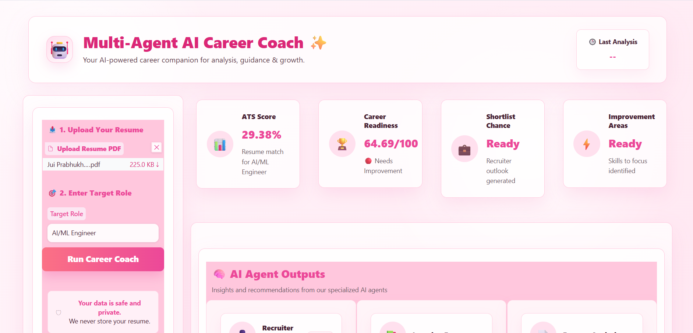

# 🤖 Multi-Agent AI Career Coach

An AI-powered career guidance platform that uses multiple specialized AI agents to analyze resumes, evaluate career readiness, identify skill gaps, recommend learning resources, generate personalized roadmaps, suggest portfolio projects, and prepare users for interviews.

---

## 🚀 Features

### 📊 ATS Score Analysis

Evaluates how well a resume aligns with a target role and provides an ATS compatibility score.

### 👔 Recruiter Agent

Simulates a recruiter review and provides:

* Shortlist Decision
* Strengths
* Concerns
* Hiring Recommendation

### 🏆 Career Readiness Score

Calculates an overall readiness score and classifies candidates as:

* Job Ready
* Almost Ready
* Needs Improvement

### 📄 Resume Analysis Agent

Analyzes resumes and identifies:

* Strengths
* Weaknesses
* Improvement Areas

### ⚠️ Skill Gap Agent

Detects:

* Missing Technical Skills
* Missing Soft Skills
* Recommended Certifications
* Priority Learning Areas

### 📚 Learning Resources Agent

Recommends:

* Courses
* Certifications
* Books
* YouTube Channels
* Practice Platforms

### 🗺️ Career Roadmap Agent

Creates a personalized 6-month learning roadmap based on the user's career goals.

### 💻 Project Recommendation Agent

Suggests portfolio projects aligned with the target role.

### 🎤 Interview Preparation Agent

Generates:

* Technical Questions
* Behavioral Questions
* Project-Based Questions

---

## 📸 Project Screenshots

### Dashboard Overview



### Career Analysis Dashboard


### AI Agent Workspace


---

## 🏗️ Project Architecture

```text
Resume Upload
      ↓
Resume Parser
      ↓
ATS Score Engine
      ↓
Resume Agent
      ↓
Skill Gap Agent
      ↓
Roadmap Agent
      ↓
Project Agent
      ↓
Interview Agent
      ↓
Recruiter Agent
      ↓
Learning Resources Agent
      ↓
Career Readiness Score
```

---

## 🛠️ Tech Stack

### Frontend

* Gradio

### Backend

* Python

### AI & NLP

* Google Gemini API
* Prompt Engineering

### Resume Processing

* PDFPlumber

### Machine Learning

* Scikit-Learn

### Development Tools

* Git
* GitHub

---

## 📂 Project Structure

```text
Multi-Agent-Career-Coach/
│
├── agents/
│   ├── resume_agent.py
│   ├── skill_gap_agent.py
│   ├── roadmap_agent.py
│   ├── project_agent.py
│   ├── interview_agent.py
│   ├── recruiter_agent.py
│   └── resources_agent.py
│
├── app/
│   └── app.py
│
├── src/
│   ├── resume_parser.py
│   ├── llm_client.py
│   ├── ats_score.py
│   └── readiness_score.py
│
├── docs/
│   └── screenshots/
│
├── requirements.txt
├── README.md
└── .gitignore
```

---


## 👩‍💻 Author

**Jui Prabhukhot**


AI/ML Enthusiast | Python Developer | Aspiring Machine Learning Engineer

---

## ⭐ Support

If you found this project useful, consider giving it a star on GitHub.
